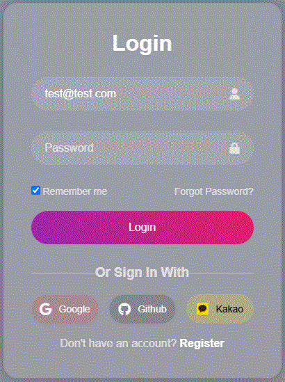
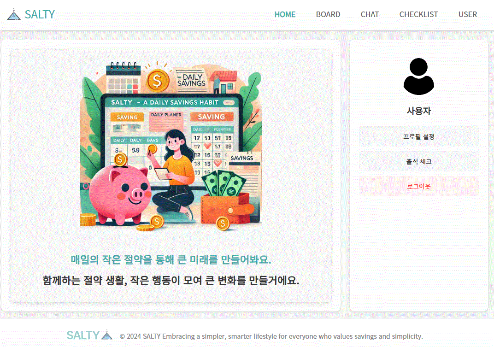
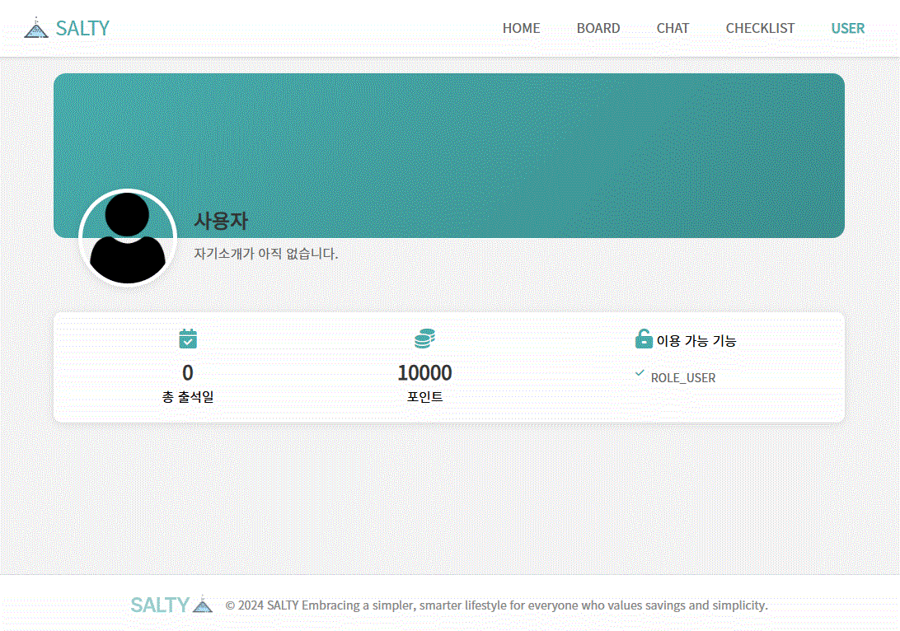

</img>

# About Salty 🧂

- 절약하는 일상을 공유하는 커뮤니티 SALTY
- 개발 기간: 2024.10.28~2024.11.13

 

# Overview

- Salty는 사용자에게 합리적 소비를 통해서 소비에 대한 좀 더 건강한 경험을 제공합니다.
- 게시판 기능을 통해서 일상적인 내용 뿐 아니라, 사용하지 않는 물건을 판매하거나, 필요한 물건을 구매할 수 있으며, 무료 나눔 또한 가능합니다.
- 챌린지와 체크리스트 기능을통해서 좀 더 효율적인 소비를 할 수 있습니다.

 

# Description

-

 

# Main Features

### FE

1. Websocket을 활용한 1:1 실시간 채팅 기능 구현
   - onopen, onmessage, onclose를 통해 이벤트 핸들링

### BE

1. Spring Security, Oauth2로 회원 인증/ 인가 구현
2. Websocket을 활용한 1:1 실시간 채팅 기능 구현
   - 브로드캐스트 방식 : 세션을 이용해 채팅방에 속한 사용자에게 메세지를 전달
   - websocketHandler를 통해 클라이언트의 메세지를 수신하고, 특정 메세지를 전달

### INFRA

 

# Screens

### 회원가입/로그인/프로필

- 소셜로그인

### 메인 화면
- 커뮤니티에서 제공하는 모든 서비스에 접근가능(사용자 정보, 게시판, 챌린지, 체크리스트)

### 사용자 관련 서비스
#### 1. 사용자 정보(User)
- 사용자의 닉네임, 프로실 사진, 자기소개 와 서비스 이용과 관련된 권한과 포인트등을 확인할 수 있습니다.

#### 2. 프로필 설정

### 달성완료 등록

- 본인 사진 등록, 달성완료 소감 등록
- 이걸해냄 도장 지급

### 마이피드

- 카테고리 선택 및 달성 여부 탭 선택

### 팔로우/친구찾기

- 팔로우 및 팔로잉, 팔로워 탭 선택
- 닉네임 검색을 통한 친구 찾기

### 전체피드

- 응원해요 피드
  - 카테고리별 조회 및 베스트 버킷리스트 조회
  - 응원해요(좋아요) 기능
  - 나도할래(스크랩) 기능

- 축하해요 피드
  - 카테고리별 조회 및 베스트 버킷리스트 조회
  - 축하해요(좋아요) 기능
  - 나도할래(스크랩) 기능

### 공유하기

- 이미지 저장

- 카카오 공유 API 사용

- url 공유

  

# Service ENV

- Java 17
- Spring Boot 3.3.5
- MySQL 8.0.39

 

# Tools

- GitHub
  - GitHub Flow 전략으로 branch 관리
  - 코드 버전 관리

- Notion
  - 아이디어 회의
  - 컨벤션 정리
  - 산출물 및 공통 문서 관리

- Figma
  - 와이어프레임

- Swagger
  - REST API 문서화
 

# Stacks

### FE

### BE

### INFRA

  

# Project Outputs

- [기능명세서](https://www.notion.so/h-jun/12deb052dcc680d787b0da0dc84b9c70?v=12deb052dcc681ddb2ca000c72a456eb)
- [Notion](https://www.notion.so/h-jun/5-New-12aeb052dcc6808aabd5e312f1a89076)
- [WireFrame & Design](https://www.figma.com/file/5dLrdcNUMg1AgGSjWIHWkp/%EC%99%80%EC%9D%B4%EC%96%B4%ED%94%84%EB%A0%88%EC%9E%84-%EB%B0%8F-%EB%94%94%EC%9E%90%EC%9D%B8?type=design&node-id=0-1&mode=design)

 

# Members

- [정상윤](https://github.com/afteryoon)(BE)
- [최홍준](https://github.com/HBumzz)(BE)
- [이진헌](https://github.com/sodami-hub)(BE)
- [김근아](https://github.com/listoria)(BE)
- [문규찬](https://github.com/gyuchanm)(BE)